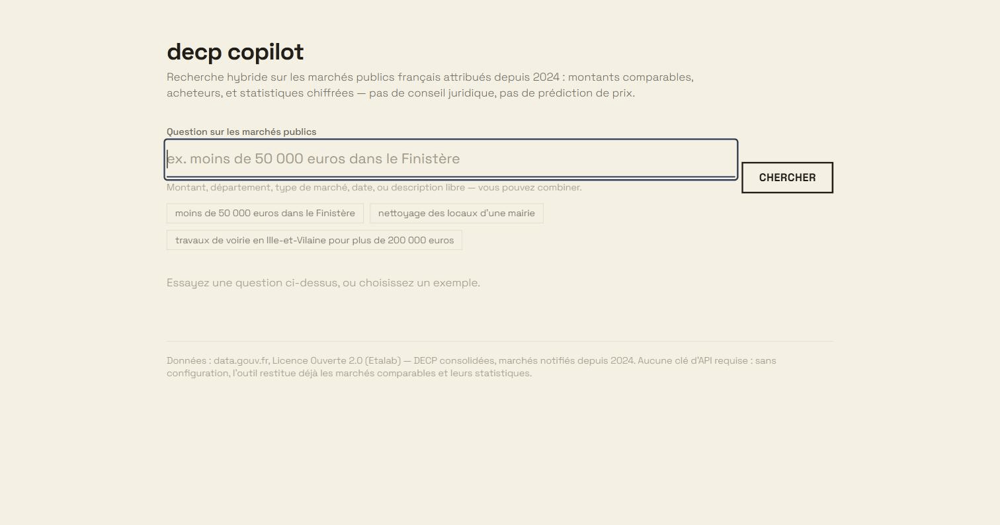
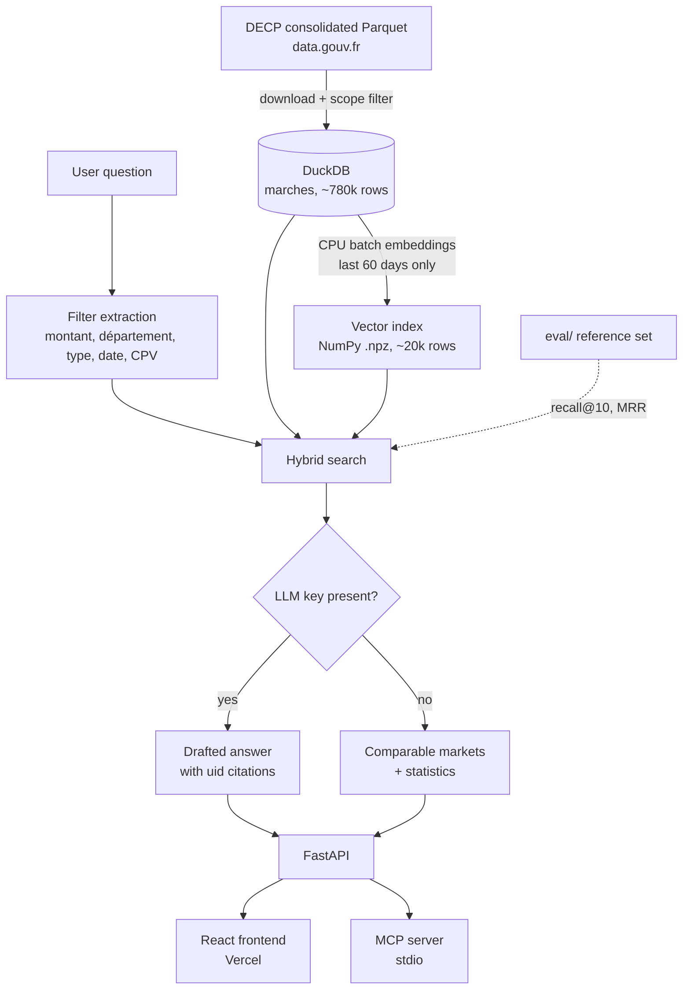

# decp-copilot

Retrieval-augmented search over French public procurement awards (DECP), with measured retrieval quality.

**Live demo:** <https://decp-copilot.vercel.app> — no sign-up, no API key needed.



## Evaluation results

45 questions, hand-written from real markets in the currently indexed corpus and verified one by one against the database (methodology below). Generated by `make eval` on 2026-09-05; regenerate any time with `make eval` (needs `python -m decp ingest` and `python -m decp index` first) — the numbers below are copied verbatim from the current `eval/results.md`.

| Configuration | Questions | Recall@10 | MRR | Mean latency (ms) | p95 latency (ms) |
|---|---|---|---|---|---|
| **hybrid** (shipped) | 45 | **0.60** | **0.41** | 372.5 | 959.1 |
| semantic-only (baseline) | 45 | 0.18 | 0.11 | 68.2 | 80.0 |

By question category — this is the number that justifies hybrid over semantic-only (SPEC.md section 2):

| Category | hybrid recall@10 | semantic-only recall@10 |
|---|---|---|
| structured (montant/département only) | **0.50** | 0.00 |
| mixed (filter + content) | **0.90** | 0.10 |
| semantic (content only) | 0.38 | **0.46** |

Hybrid wins decisively as soon as a montant or département is involved — exactly the case the architecture targets, since embedding a number or a department name and hoping cosine similarity respects it doesn't work (0.00 recall for semantic-only on structured questions). **On purely descriptive questions, semantic-only actually edges out hybrid.** Fusing in BM25 can dilute a strong semantic signal when the question deliberately avoids the market's own vocabulary (which every question here does, by construction — see methodology). This is the most interesting number in the repo, and it's reported as a real, unresolved trade-off — not smoothed over, not hidden below the fold.

Two bugs were found and fixed while building this evaluation (not before it — this is what the evaluation is for):
- **Département matching preferred the wrong region.** `extract_filters` picked the first dictionary match rather than the most specific one, so "Maine-et-Loire" resolved to "Loire", "Haute-Savoie" to "Savoie", "Seine-et-Marne" to "Marne" (a shorter département name is a hyphen-bounded substring of the longer one). Fixed by matching longest names first (`src/decp/retrieval/filters.py`); regression-tested in `tests/test_filters.py`.
- **An unfiltered question silently searched almost nothing.** `fetch_candidates`'s recency `LIMIT`, applied to the full ~780k-row table, was found to reach back only ~15 days for a filterless question — versus the 60-day, ~20k-row indexed window semantic search actually covers — so most of the indexed corpus was invisible to hybrid search whenever no montant/département/date/type/CPV was extracted. A first fix (passing the indexed uids as a `uid = ANY(?)` SQL parameter) made this worse: DuckDB was measured at 20+ seconds binding a ~20,000-element Python list parameter. The actual fix reuses the vector index's own `scope_cutoff_date` (already recorded in its metadata by `decp index`) as a `date_min` filter instead — a single indexed date comparison, not a giant parameter (`src/decp/retrieval/search.py`).

Neither bug would have been visible without a hand-built, hand-verified reference set: both surfaced as "hybrid quietly performs worse than it should" while writing the 45 questions and reading their results, not from reading the code.

## The problem

A small business preparing a bid for a public tender needs one number: what did comparable contracts actually cost, to whom, and where. French public buyers are legally required to publish that data, so it exists — but the consolidated file is too large for a spreadsheet, the same kind of contract gets described in free text ten different ways across buyers, and nobody can answer the question without a purpose-built tool. decp-copilot is that tool — hybrid search over ~780k awarded contracts since 2024, with a retrieval-quality evaluation most "RAG on my documents" repos never publish.

## How it works



**Hybrid, not semantic-only, by design:** a montant or a département is an exact filter — embedding "moins de 50 000 euros" and hoping cosine similarity respects a numeric threshold doesn't work. Structured filters run as real SQL predicates against the full corpus; only the free-text remainder goes through embeddings, and BM25 adds a lexical signal on top, the two fused by reciprocal rank (`src/decp/retrieval/search.py`, `src/decp/retrieval/hybrid.py`). "Evaluation results" above is the number that justifies this over a naive embedding-only search: 0.00 recall@10 for semantic-only whenever a montant or département is involved, versus 0.50–0.90 for hybrid.

## Quickstart

```bash
make install              # pip install -e ".[dev]"
make ingest && make index # download + normalize DECP, then build the vector index (~5-20 min total)
make serve                # runs the API on http://0.0.0.0:8000
```

No `OPENAI_API_KEY` anywhere above: the default degraded mode (comparable markets + statistics, no drafted prose) is a fully supported, always-on path, not a fallback — see "API and generation" below. Or skip all of this and try the [live demo](https://decp-copilot.vercel.app) instead.

## Data source, licence, and scope

- **Dataset:** [Données essentielles de la commande publique consolidées (format tabulaire)](https://www.data.gouv.fr/datasets/donnees-essentielles-de-la-commande-publique-consolidees-format-tabulaire), published on data.gouv.fr by Colmo. It aggregates and retypes the DECP that French public buyers must publish under the [22 December 2022 decree](https://www.legifrance.gouv.fr/loda/id/JORFTEXT000046850496).
- **Licence:** **Licence Ouverte / Open Licence version 2.0 (Etalab)** — confirmed on the dataset page (`"license": "lov2"` in its [data.gouv.fr API metadata](https://www.data.gouv.fr/api/1/datasets/donnees-essentielles-de-la-commande-publique-consolidees-format-tabulaire/)). Full text: <https://www.etalab.gouv.fr/licence-ouverte-open-licence>. It allows free reuse, including commercial, with attribution of the source and update date.
- **Refresh cadence:** the producer updates the consolidated Parquet/CSV files roughly daily (`"frequency": "daily"`).
- **File used:** the dataset's stable "latest resource" URL, which always points at the current `decp.parquet` (see `DEFAULT_PARQUET_URL` in `src/decp/ingest/download.py`).
- **Scope filter applied** at ingestion (`src/decp/ingest/normalize.py`), per `SPEC.md` section 1:
  - only markets notified from **2024-01-01** onward (`dateNotification`);
  - concessions excluded (`nature NOT ILIKE '%concession%'`) — the current source did not contain any as of this run, but the filter guards against future contamination;
  - one row per market **award**: `modification_id = 0` keeps the initial attribution and **drops later amendments** ("avenants") — a modification only ever touches `titulaire_*`/`montant`/`dureeMois` on top of an already-awarded market, not a fresh comparable data point, so it's noise for this tool's purpose. **Co-contractors are kept**: a market can still span several rows when it has several titulaires, since each is a genuine party to the same award, not a revision of it.

### Ingestion measurements (lot 1 criterion)

Real run, reproducible with `python -m decp ingest` (or `make ingest`), on 2026-09-05:

| Step | Metric | Value |
|---|---|---|
| Download | source file size | 234.5 MB (`decp.parquet`) |
| Download | wall time | 236.2 s |
| Normalize (DuckDB) | rows read | 3,261,627 |
| Normalize (DuckDB) | rows kept (in scope) | 781,439 |
| Normalize (DuckDB) | wall time | 4.9 s |
| Normalize (DuckDB) | database size on disk | 190.0 MB (`data/decp.duckdb`) |

The final corpus (190 MB, ~781k rows) fits comfortably on a machine without a
GPU; download time dominates total runtime and depends on network
conditions, not on ingestion logic — DuckDB's own scan-and-filter step
(reading 234.5 MB of Parquet, writing 190 MB back out) takes under 5 seconds.

## Indexed corpus scope (lot 2 criterion)

Hybrid search needs an embedding for every market's `objet`, and encoding
is CPU-only (no paid API, no GPU — SPEC.md section 1). Before deciding what
to index, `scripts/benchmark_embedding.py` measured real throughput against
the lot 1 corpus, reused for search: **~86 documents/second** for
`sentence-transformers/paraphrase-multilingual-MiniLM-L12-v2` on this
machine (single-call batches; see the engineering note below for why an
earlier chunked measurement looked ~6x slower). At that rate, the full
lot 1 corpus (781,439 rows) would take **~2.5 hours** to encode — far past
the "a few minutes, not hours" budget the spec sets.

**Decision:** index only markets notified in a **60-day sliding window**,
recomputed at index-build time from the corpus's own most recent date (not a
fixed calendar date, since the source refreshes daily — the window always
means "the last 60 days," today or a year from now). This is also the more
useful scope for the product itself: a PME pricing a bid today cares most
about recent comparable awards, not one from early 2024. Structured filters
(montant, département, date, type, CPV) are **not** limited by this window —
they still run against the full `marches` table; only semantic ranking is
restricted to what has been embedded (`src/decp/retrieval/search.py`).

A brute-force, in-memory cosine-similarity index (`src/decp/index/store.py`,
plain NumPy, persisted as `.npz`) is used instead of an ANN library like
FAISS: at this deliberately small scale (tens of thousands of 384-dim
vectors), brute force runs in single-digit milliseconds, and FAISS would
only add a dependency without buying anything.

**Engineering note — batch size, not just throughput, determines wall time:**
the real, full-scale build first measured at 6,135s (~102 min) for 22,465
rows — 40x slower than the sample benchmark predicted. The cause was
`embed_texts`'s outer batching: calling the real model's `.encode()`
repeatedly over small chunks (256 rows) carries a large, roughly fixed
per-call overhead in this environment (~15s), so many small calls cost far
more than a couple of large ones — measured directly on a 2,000-row sample:
**~13 docs/s chunked at 256 rows/call, versus ~86 docs/s in a single call**,
a 6x difference from batch size alone, same model, same machine, same data.
Raising the default outer batch size to 10,000 (so realistic corpus sizes
fit in one or two calls) fixed it; the measurement below is from the
corrected code.

Real run, reproducible with `python -m decp index` (or `make index`), on 2026-09-05:

| Metric | Value |
|---|---|
| Indexed window | markets notified in the last 60 days (cutoff computed from the corpus's own max date) |
| Rows indexed | 22,465 |
| Encoding wall time | 290.9 s (~4.8 min) |
| Vector index size on disk | `data/index/decp.index.npz` |
| End-to-end search latency (query encode + structured filter + BM25 + semantic + fusion) | 168–389 ms per query, measured over several real questions |

(See "Evaluation results" above for latency broken down over the full 45-question set, including the unfiltered-question case, which is slower — up to ~1s at p95 — for reasons explained there.)

## Evaluation methodology

- **Reference set**: `eval/questions.jsonl`, 45 questions. Each was written by hand after reading a real market's real fields (montant, département, objet, date) queried directly from `data/decp.duckdb` — never generated from the document text itself, which would make the evaluation circular and inflate scores artificially. Semantic questions paraphrase the market's content in different words than its `objet` field; structured questions encode the market's real montant/département/type as a filter; mixed questions do both. Every question is re-verified against the live database by `python scripts/verify_eval_questions.py` (checked before it was added, and re-checkable any time the corpus changes).
- **recall@10**: fraction of a question's expected market(s) found in the top 10 results (1.0 = always found).
- **MRR**: mean reciprocal rank of the first expected match (1.0 = always ranked first, 0 = never found).
- **hybrid** vs **semantic-only**: `decp.retrieval.search.search` (structured filters on the full lot 1 corpus, plus BM25 and cosine similarity on the indexed corpus, fused by reciprocal rank) against `decp.retrieval.search.semantic_search` (cosine similarity alone, same indexed corpus, no filters, no BM25) — the baseline the architecture in SPEC.md section 2 argues against.
- Not part of CI (SPEC.md section 7): run by hand, its dated output is versioned in `eval/results.md`.

## API and generation (lot 3)

`src/decp/api/app.py` exposes two endpoints over the hybrid search from
lot 2: `GET /search` (raw ranked markets) and `GET /answer` (search plus,
when available, a cited natural-language answer). `GET /health` reports
whether generation is available.

**The no-key mode is the default, not a fallback bolted on afterwards**
(SPEC.md section 1: "un mode nominal documenté, pas une panne"). With an
empty `.env`, `/answer` returns the matching markets and their statistics
(count, montant total/min/max/moyen/médian) computed by
`src/decp/answer/degraded.py` — no LLM call, no API key, nothing to
configure. This is exactly what a recruiter cloning the repo without
touching `.env` will see.

When a generator *is* available (see below), `/answer` instead returns a
drafted answer — but only if it cites at least one market's `uid`.
`decp.answer.generate.generate_answer` builds the prompt (which explicitly
demands `[uid: ...]` citations for every figure), calls the model, and
raises `UncitedAnswerError` if no known `uid` appears in the response; the
API catches that and **falls back to the degraded answer** rather than
show an answer with unverifiable figures (SPEC.md section 7). This is
checked directly: `tests/test_generate.py` feeds a fake generator an
uncited response and asserts the error is raised, and
`tests/test_app.py::test_answer_endpoint_falls_back_to_degraded_when_uncited`
checks the same thing through the actual HTTP endpoint.

Generation resolution, in order (`decp.answer.generate.load_generator`):
1. an `OPENAI_API_KEY` — sent to `OPENAI_BASE_URL` (default `api.openai.com`,
   but any OpenAI-compatible chat completions endpoint works, e.g. Groq's
   free tier — see `.env.example`);
2. otherwise, a locally reachable Ollama server (`OLLAMA_BASE_URL`, default
   `localhost:11434`) — free, no key, but needs Ollama installed and running;
3. otherwise, the degraded mode above.

**Explicit verification, with a genuinely empty `.env`** (2026-09-05), against
the real lot 1/2 data — both generation branches actually exercised, not just unit-tested:

| Scenario | `GET /health` | `GET /answer` |
|---|---|---|
| Empty `.env`, no Ollama reachable (`OLLAMA_BASE_URL` pointed at a closed port) | `generation_available: false` | `mode: "degraded"`, real markets + stats, `answer: null` |
| Empty `.env`, a local Ollama server reachable (this machine has one) | `generation_available: true` | `mode: "generated"`, a real `llama3.2` answer citing `[uid: ...]`, validated by `generate_answer` |

Both started and answered correctly with `python -m decp serve` and no
`OPENAI_API_KEY` set anywhere — the lot 3 criterion.

## Frontend (lot 5)

`web/` — React + Vite + TypeScript + Tailwind CSS v4, no component
library: every element (table, chips, badges, skeleton) is styled
directly with Tailwind utilities, per SPEC.md section 4. Full design
rationale (typography, palette, density, the five states) is in
`web/README.md`. In short:

- **Typography**: one characterful family (Space Grotesk) across the
  whole weight range — bold for montants and headings, light for
  metadata — with `tabular-nums` on every figure so columns of amounts
  align.
- **Palette**: a warm tinted paper background, near-black ink, and
  exactly two accents — a deep burgundy reserved *only* for montant
  figures, a muted navy for everything interactive.
- **Density**: results are rows in a real `<table>` (`table-fixed` +
  `line-clamp-2`), not cards — comparison is the point.
- **Five states, handled explicitly**: idle, loading (with a "waking up"
  hint for a sleeping free-tier API), error with retry, no results, and
  results — themselves split into degraded (the default: stats + table,
  no LLM call) and generated (adds a cited paragraph). Verified by hand
  in a real browser against the real API, not just by reading the code —
  see the bugs below.

Two more bugs were found this way, on top of the two from lot 4:
- **A generation backend failure crashed the whole request.** A real,
  slow local Ollama call exceeding its 60s timeout raised an unhandled
  exception inside `/answer`, returning a 500 instead of the guaranteed
  degraded baseline. Fixed by catching any generation failure (not just
  `UncitedAnswerError`) and falling back to degraded, logged not
  swallowed (`src/decp/api/app.py`); regression-tested with a generator
  that raises `TimeoutError`.
- **The Docker image never actually built.** `pyproject.toml` declares
  `readme = "README.md"` (required by its build backend, hatchling), but
  the Dockerfile only copied `pyproject.toml` and `src/` — a build nobody
  had actually run before this lot. Fixed by copying `README.md` too.

## Deployment

**Live demo:** <https://decp-copilot.vercel.app> (frontend) — calls the
API at <https://decp-copilot.fly.dev>. Deployed with an empty `.env` /
no `OPENAI_API_KEY`: what loads by default is the degraded mode (see
"API and generation"). Verified end to end in a real browser (search,
filters, stats, table all render against the live API), including a
fresh, cookie-free tab and an actual private-browsing window — the lot 5
criterion.

Two independent, free-tier deployments, wired together by one environment
variable:

**API — Fly.io** (a Hugging Face Space was tried first; its Docker SDK
build kept prompting for payment on this account, so Fly.io was used
instead — its Dockerfile SDK worked on the free/hobby tier with no card
required at the time of this deploy):
1. `flyctl auth login`, then from the repo root: `flyctl launch
   --no-deploy` — detects the root `Dockerfile`, asks for an app name and
   region, and writes `fly.toml` (already committed here; internal port
   7860, `min_machines_running = 0` so the machine sleeps when idle and
   wakes on request — the free-tier sleep behaviour the frontend accounts
   for).
2. Optional: `flyctl secrets set OPENAI_API_KEY=...` (and
   `OPENAI_BASE_URL`/`OPENAI_MODEL` for a non-OpenAI provider like Groq)
   to enable drafted answers. Skipped on this deploy — degraded mode is
   the default, and still fully useful.
3. `flyctl deploy` — builds remotely on Fly's infrastructure (not your
   machine), baking the dataset and vector index in at build time
   (`RUN python -m decp ingest && python -m decp index`); expect **10–15
   minutes**, it's real work, not a hang. Gives a `https://<app>.fly.dev`
   URL.

**Frontend — Vercel**
1. Import this GitHub repo as a new Vercel project (sign up with GitHub
   for automatic repo access).
2. Set **Root Directory** to `web`. Vercel auto-detects Vite (build
   command `npm run build`, output directory `dist`).
3. Add a project environment variable `VITE_API_BASE_URL` set to the
   Fly.io URL from above (no trailing slash).
4. Deploy. Vercel gives a `https://<project>.vercel.app` URL.

The frontend's `fetchAnswer` (`web/src/api.ts`) treats a slow first
response as the API waking up from the free tier's sleep, not an error —
see "Frontend" above, and "Known limitations" below.

## MCP server (lot 6, bonus)

`mcp/server.py` exposes the same hybrid search and market lookup as two
[MCP](https://modelcontextprotocol.io) tools, over stdio, for any MCP
client (Claude Desktop, Claude Code...): `search_marches_tool` (montant,
département, type, date, and/or free text — same query language as the
web UI) and `get_marche_tool` (full details for one market by its `uid`).
Both reuse `decp.api.app`'s `Dependencies`/`load_real_dependencies()` —
same database, model, and vector index as the HTTP API, no separate
loading logic.

Run it with `make mcp` (needs `python -m decp ingest` and `python -m decp
index` first, like `decp serve`); see `mcp/README.md` for the full tool
reference and how to point a client (e.g. Claude Desktop's
`claude_desktop_config.json`) at it.

## Development

```bash
make install   # pip install -e ".[dev]"
make lint      # ruff check .
make test      # pytest
make ingest    # python -m decp ingest — downloads and normalizes the DECP dataset
make index     # python -m decp index — encodes the recent-window corpus and builds the vector index
make serve     # python -m decp serve — runs the API on http://0.0.0.0:8000
make mcp       # python mcp/server.py — runs the MCP server over stdio
```

No API key is required to install, lint, test, ingest data, build the
index, or serve the API — see "API and generation" above.

## Known limitations

- **Out of scope by design** (SPEC.md section 1): no legal advice, no
  price prediction — the tool restitutes and compares, it doesn't
  recommend. No concessions or pre-2024 contracts (different regulatory
  schema). No personal data collection or scraping — the official
  consolidated file only.
- **The deployed API sleeps on inactivity** (Fly.io free tier,
  `min_machines_running = 0`) and can take up to a minute to wake on the
  first request after a while — the frontend's loading state says so
  explicitly rather than looking stuck (`web/src/api.ts`'s `onSlow` hint).
- **Semantic search only covers a 60-day sliding window** of notified
  markets (~20k of the ~780k in the full ingested corpus), a deliberate
  CPU-time trade-off — see "Indexed corpus scope". Structured filters
  (montant, département, date, type, CPV) still reach the full corpus.
- **On purely descriptive questions, semantic-only search currently beats
  hybrid** (0.46 vs. 0.38 recall@10 — see "Evaluation results"): fusing in
  BM25 can dilute a strong semantic signal when a question deliberately
  avoids the market's own vocabulary. Not fixed, reported as-is.
- **Some source `objet` text is visibly mis-encoded** (mojibake, e.g.
  doubled accented characters) in the upstream DECP file itself — the
  pipeline reads it as-is from the producer, no re-encoding is attempted.
- **Local Ollama generation is slow on CPU** (tens of seconds per answer
  on this project's dev machine) — a hosted free-tier provider (e.g.
  Groq) via `OPENAI_API_KEY` is markedly faster in practice; either path
  is unavailable-safe (falls back to degraded, see "API and generation").
- **Département extraction is name-based, not city-based**: "à Marseille"
  won't resolve to Bouches-du-Rhône, only "dans les Bouches-du-Rhône"
  will — a known gap in `extract_filters`, not silently miscategorized.

## Licence

MIT — see `LICENSE`, for the code in this repository. The DECP dataset
itself is published under the Licence Ouverte 2.0 (Etalab), see above.
